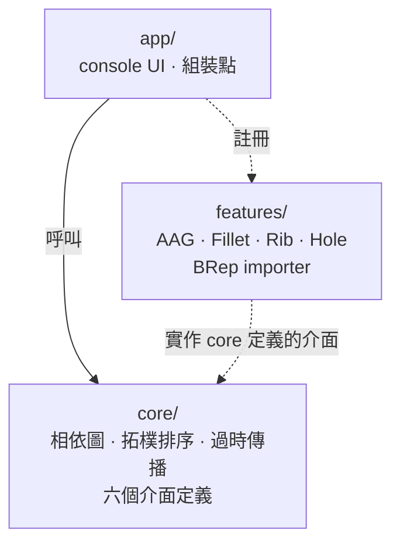
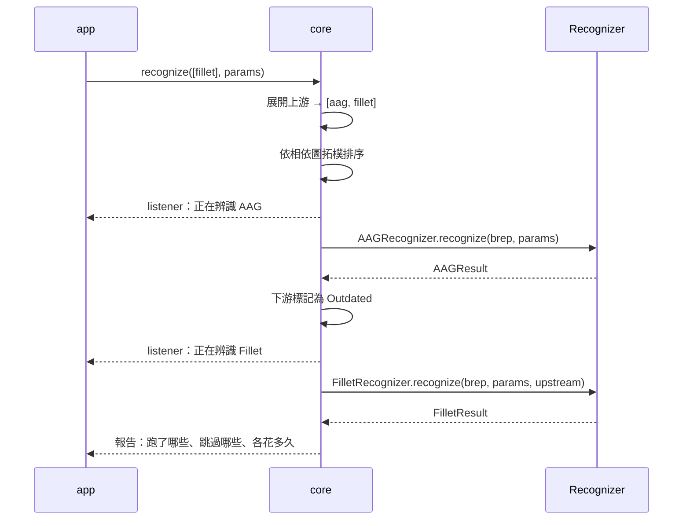

# DemoFR — Feature Recognition Framework

一個特徵辨識框架，最終以 library 形式內嵌在 CAD 應用中。它負責的是**特徵之間的相依關係、辨識的執行順序、結果的新舊管理**；辨識演算法本身不屬於框架，而是從外面插進來的實作。

目前是**架構 POC**：不掛真實 CAD、不寫真實演算法，但所有對外接縫都以介面留好。

## 現況

程式碼已依 [SPEC.md](./SPEC.md) 實作完成：`core/` `features/` `app/` 三層 + 七個驗收場景的自動化測試（全數通過）。

## 文件

| 文件 | 內容 |
|---|---|
| [CONTEXT.md](./CONTEXT.md) | 詞彙表。名詞的唯一定義來源，不含實作細節 |
| [SPEC.md](./SPEC.md) | 行為規格。狀態轉移、執行流程、明確不做的事、驗收場景 |
| [docs/adr/](./docs/adr/) | 關鍵決策與理由 |
| [docs/PATTERNS.md](./docs/PATTERNS.md) | 設計模式說明：用了哪些模式、各買到什麼 |
| [docs/TUTORIAL.md](./docs/TUTORIAL.md) | Console demo 逐步教學 |

三則 ADR：[幾何一次匯入自有格式](./docs/adr/0001-import-geometry-into-own-brep.md)、[上游重算後一律讓下游過時](./docs/adr/0002-always-invalidate-downstream.md)、[特徵集合是開放的](./docs/adr/0003-open-feature-set.md)。

## 目標架構

三個資料夾，對應三種不同的變動原因：



核心不認得任何一種具體特徵。它只認得六個介面，以及註冊時配發的 `FeatureId`：

| 介面 | 誰實作 |
|---|---|
| `IGeometryImporter` | 每家 CAD 一個 |
| `IRecognizer` / `IParameters` / `IFeatureResult` | 每種特徵一組 |
| `IParameterStore` | Host（參數持久化，per-model） |
| `IRecognitionListener` | Host（即時進度與訊息） |

具體型別的知識分佈在**兩端**——Recognizer 內部與呼叫端 UI，中間的核心保持空白。

## 一次辨識請求



「自動補算上游」和「排序使用者給的清單」是同一個機制，不是兩套邏輯。呼叫端給 `[fillet, aag]` 或 `[aag, fillet]`，結果完全相同。

## 特徵與相依

| 特徵 | 對使用者可見 | 直接相依 |
|---|---|---|
| AAG | 否（Internal Feature） | 無 |
| Fillet | 是 | AAG |
| Rib | 是 | Fillet |
| Hole | 是 | Fillet |

AAG 是面鄰接圖——辨識用的衍生資料，使用者不需要知道它存在，但相依與過時的規則對它一視同仁。

## 建置與執行

```bash
cmake -B build && cmake --build build
```

跑測試（[SPEC.md](./SPEC.md) 七個驗收場景的可執行版本，外加註冊驗證與失敗語意）：

```bash
./build/demofr_tests
```

跑 console demo：

```bash
./build/demofr
```

完整的逐步教學見 [docs/TUTORIAL.md](./docs/TUTORIAL.md)。

---

## 報告講稿

照著念大概 2-3 分鐘。

### 開場

> 「這是一個**特徵辨識**的框架，會從幾何模型裡辨識出圓角、肋、孔這些製造特徵。我要講的不是演算法，而是**框架本身**——因為這個系統真正難的地方不在怎麼認出一個孔，而在**特徵之間互相依賴**：要認圓角，得先有面鄰接圖；要認肋，得先有圓角。」

### 問題

> 「有相依就會有三個問題：**順序**——使用者亂點，誰先跑？**補算**——他只點了肋，但圓角還沒算，怎麼辦？**過時**——他改了參數重跑面鄰接圖，下游那些結果還能不能信？
>
> 這三件事跟『怎麼認出一個孔』完全無關，但每加一種特徵都會被踩到一次。框架的工作就是**把這三件事一次解決掉，讓演算法作者永遠不用想它們**。」

### 核心設計

> 「做法只有一句話：**核心不認得任何一種具體特徵。**
>
> 每個辨識器自己宣告『我叫 fillet、我依賴 aag、我的預設半徑是 1』，核心把這些宣告組成一張相依圖。之後所有事情都是這張圖的推論——排序是拓樸排序，補算是往上展開，過時是往下傳播。**核心從頭到尾不知道 fillet 是什麼。**
>
> 所以加一種新特徵，只要新增一個檔案、註冊一行，相依圖、排序、過時傳播全都自動適用。」

### 兩個刻意的取捨

> 「第一，**幾何一次匯入我們自己的格式**，不即時查詢 CAD。因為有些格式光是取一個面的 id 就要跑一次迴圈，如果每次幾何存取都穿回 CAD，效能會被拖垮。代價是匯入時間跟記憶體，我們認了。
>
> 第二，**上游重算後，下游一律標成過時，不比對結果**。就算重算出來一模一樣也照標。因為要比對就得逼每個演算法作者寫一個可靠的比較函式——少比一個欄位就會靜默給出錯的答案。**保守重算只是慢，錯誤跳過是給錯的結果。**」

### 收尾

> 「這個架構真正買到的東西是：**演算法作者只需要想演算法。** 相依、順序、補算、過時，一件都不用碰。」

### 小提醒

- 時間緊 → 只講**開場 + 問題 + 核心設計**，取捨那段跳過。
- 被問「為什麼不用 enum 就好？」→ 因為 enum 是封閉集合，加一種特徵要改六個地方，而且全在核心。
- 被問「這樣不會失去型別安全嗎？」→ 會失去一部分：核心用執行期的 id。但具體型別在兩端都還在——寫演算法的人和用結果的人都是 typed 的，只有中間那層刻意保持空白。
