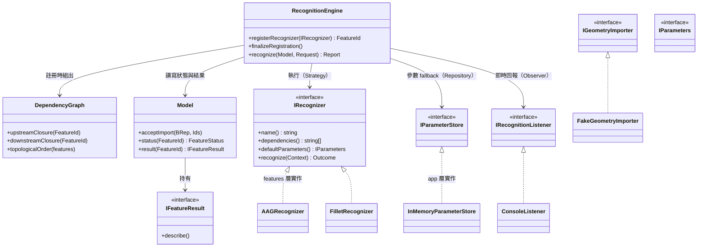

# 設計模式與架構說明

核心（`core/`）只做三件事：**相依圖、執行順序、結果新舊管理**——它從頭到尾不認得 fillet 是什麼。每種特徵的知識全部住在 `features/`，由註冊機制插進來。

本文說明這個設計用到哪些模式、各自買到什麼。

## 模式總表

| 模組 / 技巧 | 使用模式 | 好處 |
|---|---|---|
| [RecognitionEngine](../core/RecognitionEngine.h) `registerRecognizer()` | **Registry Pattern**（註冊式插件） | 核心不認得任何具體特徵；加一種特徵 = `features/` 一個新檔 + 組裝點一行（[ADR-0003](./adr/0003-open-feature-set.md)） |
| [IRecognizer](../core/IRecognizer.h) + 各 `XxxRecognizer` | **Strategy Pattern** | 每種特徵自帶演算法，統一介面、可互換；演算法作者只需要想演算法 |
| `core/` 六個介面 ↔ `features/` `app/` 實作 | **依賴反轉（DIP）/ Ports & Adapters** | 依賴一律指向核心；換 CAD、換 UI、換儲存都不動核心 |
| [IRecognitionListener](../core/IRecognitionListener.h) | **Observer（callback）** | 即時進度、per-feature 計時、過時通知推給 host；核心內零 I/O、零 `cout` |
| [FeatureId](../core/FeatureId.h) | **Value Object** | 不可變、以 index 比對（不比字串）；private 建構子 + friend 保證只能由框架配發 |
| [DependencyGraph](../core/DependencyGraph.h) | **DAG + 拓樸排序** | 排序、自動補算上游（upstream closure）、過時傳播（downstream closure）都是**同一張圖的三種推論** |
| [RecognitionOutcome / Report](../core/RecognitionReport.h) | **Result Object（錯誤即值）** | 不丟例外跨 library 邊界（SPEC §3.7）；跑了什麼、跳過什麼、為什麼，報告裡全有——fail loud |
| [IParameterStore](../core/IParameterStore.h) | **Repository Pattern** | 「上次成功用的參數」的持久化交給 host 實作；POC 用 in-memory map，之後換 CAD 偏好系統 |
| [IFeatureResult](../core/IFeatureResult.h) `describe()` | **自描述物件** | 新特徵自己會描述自己，debug dump 永遠不用改 |
| [app/main.cpp](../app/main.cpp) | **Composition Root + 建構子注入** | 所有 wiring 集中一處；測試用同一套介面注入假件（RecordingListener） |
| `resolveParameters()`（[RecognitionEngine.cpp](../core/RecognitionEngine.cpp)） | **三層 fallback**：本次請求 → 上次成功 → 預設值 | 使用者調過的參數不會被無聲換回預設（SPEC §3.4） |

## 核心原則：型別知識在兩端，中間空白

這是整個架構最重要的一招，貫穿參數和結果兩條路：

```
UI（typed）──建立 FilletParameters──▶ core（只認 IParameters，不解讀）──轉交──▶ FilletRecognizer（cast 回自己的型別，安全）
UI（typed）◀──dynamic_cast 取回 FilletResult── core（只認 IFeatureResult）◀──產生── FilletRecognizer
```

- **UI 端**本來就認得具體型別（它要為 radius 畫輸入框）
- **Recognizer 端**cast 回自己建立的型別，永遠安全
- **中間的核心**只當保管箱和傳遞管道——所以加特徵不用動它

## 合法依賴方向

```
app ──呼叫──▶ core ◀──實作介面（依賴反轉）── features
app ──註冊時建立──▶ features
```

- ✅ `app → core`、`app → features`、`features → core`
- ❌ `core → features`（核心 grep 不到任何一個特徵名）
- ❌ `core → app`
- ❌ `features` 之間互相 include 演算法細節（Fillet 讀 AAG 是透過 `dependencyResult("aag")` + 結果型別，不是呼叫 AAGRecognizer）

## Class Diagram



## 一次 recognize 的流程（模式在哪裡發揮）

```
ConsoleUi.handleRecognize("rib")
  └─ engine.recognize(model, request)
       ├─ expandTargets()        ← DAG：上游閉包，把非 Valid 的上游加進待辦（自動補算）
       ├─ topologicalOrder()     ← DAG：拓樸排序，使用者輸入順序無關
       └─ 逐一 runOne()
            ├─ listener.onRecognitionStarted()   ← Observer：「正在辨識 aag」
            ├─ resolveParameters()               ← 三層 fallback（Repository 在第二層）
            ├─ recognizer.recognize(context)     ← Strategy：features 層的演算法
            ├─ model.storeResult()               → Valid
            ├─ propagateOutdated()               ← DAG：下游閉包，Valid → Outdated
            └─ 失敗時：狀態不動、下游 blockedBy   ← Result Object，不丟例外
       └─ 回傳 RecognitionReport（跑了誰、跳過誰、各花多久）
```
